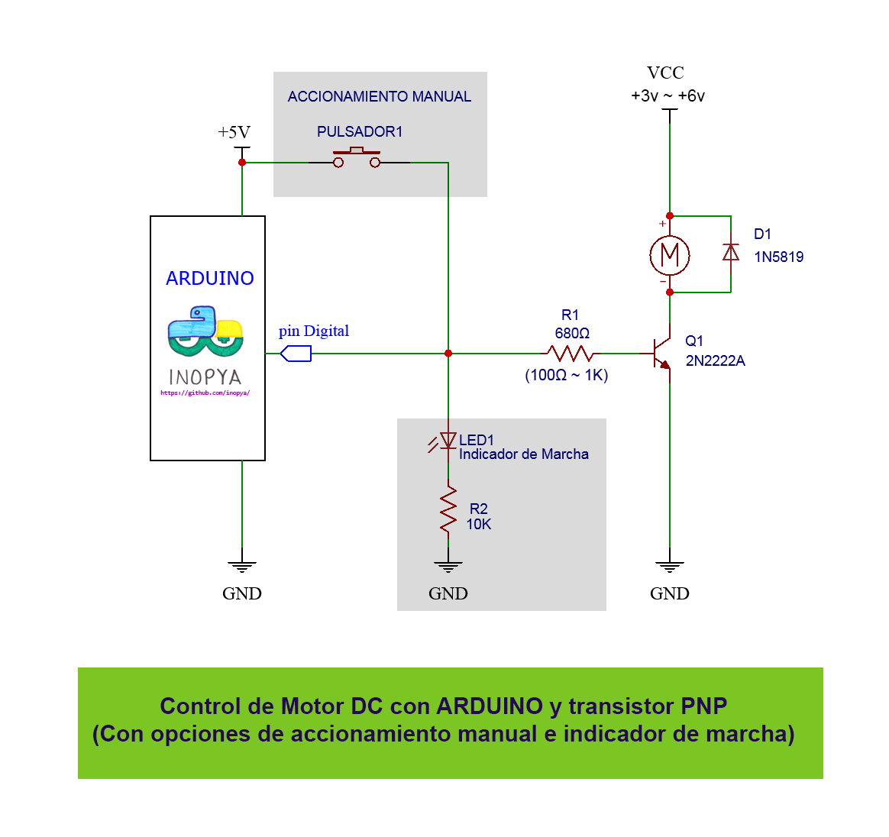

# Riego automatizado para jardin  
##(EN DESARROLLO...)##
Practicas con Arduino.

Creacion de un riego automatizado a escala jardin domestico.

Podremos extender las funcionalidades de nuestro montaje tanto como queramos.
Las posibilidades son "infinitas", desde lo mas básico, un riego temporizado, a que este se produzca en funcion de la humedad del suelo o que tenga en cuenta variables climatologicas para asi evitar regar si llueve o hacerlo evitando las horas de sol...
Podremos tambien dotar a nuestro sistema de una opcion de riego manual, e incluso tener en cuenta esos periodos de riego manual para ajustar de esa forma los que e producen de forma automatica y/o periodica.
Quizás deseemos implementar comunicaciones BlueTooth o wifi para disponer de informacion y control desde una aplicacion movil o desde programas de mensajeria como telegram.

Lista de materiales:

- Arduino UNO (NANO/MEGA...)
- Mini bomba de riego para jardín (de entre 3 y 6V).
- Dado que la bomba que usaremos tiene un consumo de entre 150 y 200 mA, no será factible conectarla directamente a una salida de Arduino
  Necesitaremos por tanto un Rele para el control de la limentacion de la bomba o bien controlar este a traves de un transistor, 
  opcion muy interesante dado el no excesivo consumo de esta. Y un transistor nos brinda la opcion de una rapida conmutacion y nos "libera" del desgaste que no podriamos     evitar en los contactos de un relé. 
- Higrometro de suelo
- Sensor de humedad ambiente
- Sensor de Temperatura
- Sensor de luz
- Sensor BlueTooth
- ESP8266

**Posible esquema conexion para nuestra bomba**

Podemos disponer de un pulsador para accionamiento manual de la bomba asi como un led indicador de que esta está en marcha.

Podemos observar que junto a nuestro motor aparece un diodo en una "extraña" posicion.
A esta configuracion se la denomina *Diodo en Antiparalelo*

**DIODO EN ANTIPARALELO**

Su principal uso es como elemento de descarga para las bobinas.
Por tanto es muy interesante emplearlos junto a reles mecanicos y motores.

Cuando una bobina se conecta a una fuente de alimentación acumula energia en forma de campo magnetico hasta igualar el potencial de la fuente.
Y cuando dejan de estar alimentadas el campo magnetico que almacenan como consecuencia del paso de corriente por ellas, se "disipa" devolviendose al circuito nuevamente en forma de una corriente electrica.
Pero el tiempo que lleva "eliminar" ese flujo de corriente de la bobina es mayor que el tiempo que tarda en desconectarse la fuente de alimentacion.
Asi que uan vez abierto el circuito y durante unos breves instantes esa corriente puede crear elevadas tensiones de cientos de voltios en los componentes cercanos lo que puede superar el aislamiento del aire y generar arcos electricos en el caso de los contactos de un rele o de un iterruptor e incluso superar el aislamiento de semiconductores como los transistores.
Tambien puede introducir ruido electrico en nuestro circuito y provocar que elementos como los microcontroladores se bloqueen o se reinicien.
El diodo puesto en esta configuracion entra en conduccion en el momento de la desconexion y se encarga de hacer retornar dicha corriente electrica sobre la propia bobina, evitando de esta forma que afecte a partes sensibles de nuestro circuito.

En nuestro caso es precisamente por eso que usamos esta configuracion de diodo en antiparalelo junto al motor de nuestra bomba de riego. Para evitar posibles daños en el transistor que usamos para el control de la alimentacion y ademas evitar señales espurias que pudiesen interferir en el correcto funcionamiento de nuestro microcontrolador.

